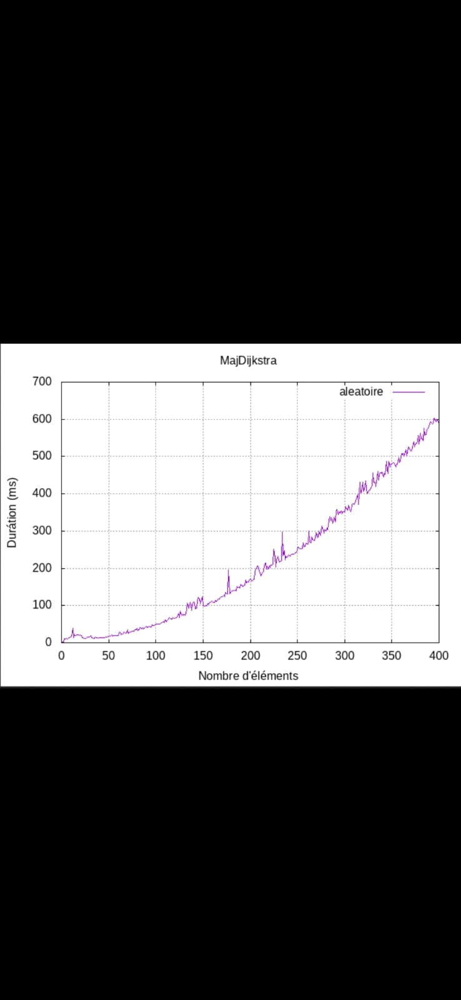

# Shortest-Path : Implementation of Dijkstra in Graph represented by list of adjacency or matrix files

Code réalisé par Paulin AVRIL, João Lucas SANTOS PENHA DE OLIVEIRA, Yaniv BENICHOU et Guillaume BAUDIN DE LA VALETTE

The complexity of our algorithm is **0((|A|+|S|)*log(|S|))** where |S| is the number of vertices and |A| the number of edges. <br>
This code will produce PNG files of Graphs, the trace of the algorithm in a graph , and will test the algorithm on various Graph size (until 400 elements) with random values. <br>

 
## Requirements 
Make sure to have the [ffmpeg](https://ffmpeg.org/) library and the [graphviz](https://graphviz.org/) library before compiling , we use it to produce videos from generated PNG files by Dijkstra Algorithm. 
``` bash
sudo apt-get install ffmpeg  
sudo apt install graphviz 
```

## How to execute
In order to test our code , we have makeFiles as you can just do , on the ~/Shortest-Path/ repertory : <br>
Makefile commands : 

> make   &nbsp;&nbsp;&nbsp;&nbsp;&nbsp;&nbsp;#To produce the executable 

> make clean   &nbsp;&nbsp;&nbsp;&nbsp;&nbsp;&nbsp;#To remove executables files

> make mrproper   &nbsp;&nbsp;&nbsp;&nbsp;&nbsp;&nbsp;#To remove the generated files in the ouput/ folder

Theses commands can be executed on the ~/Shortest-Path/ repertory to affect every folders in one command or you can executed them only in a specific foloder if you want to affect only this folder.

## Programme 1
In the ~/programme1/ repertory :

> make   

Then

> ./programme1.exe --filename --source --destination

where:

--filename: represents the location of the .adj file <br>
--source: represents the initial node <br>
--destination: represents the node of destination <br>

it will create .dot files and .png files in the output/filename/ directory, where filename is the name of the file placed in the input.
You can also change the definition of the DOT_PATH constant by commenting on line 4 of the file ../include/treatmentFiles.h. that way, the program will only display the result of the path, without creating any file.

### Exemple 1

>./programme1.exe input/graph1.adj 0 7

if DOT_PATH is defined, the program will create 9 dot files and 9 png files in the output/dotFiles/graph1 and output/pngFiles/graph1 directories. Containing the information of all the stages to find the path of all the node. <br>
Also,the distance and the path between the nodes 0 and 7 will be displayed on the terminal.

### Exemple 2

>./programme1.exe input/graph1.adj 0 -all

similarly to the previous example, the code will produce the same files however the program will display all possible paths from the start node 0

## Programme 2
on the  ~/programme2/ repertory : 
> make 
Then
> ./programme2.exe --out --in --filename

Where:

--filename: represents the location of the .adj file <br>
--out: represents the output format, there are 3 possibilities : -dot, -adj, -la <br>
--in: represents the initial file format, there are 2 possibilities: -a, -l <br>
### Exemple 1

>./programme2.exe -dot -a input/adj/graph1.adj

In this case, the program will create the output/dot/graph1.dot file and output/png/graph1.png containing the information of the graph from the input/adj/graph1.adj 
### Exemple 2

>./programme2.exe -dot -l input/la/graph1.la

In this case, the program will create the output/dot/graph1.dot file and output/png/graph1.png containing the information of the graph from the input/la/graph1.la 

### Exemple 3

>./programme2.exe -la -a input/adj/graph1.adj

In this case, the program will create the output/la/graph1.la file containing the information from the input/adj/graph1.adj . but in the adjacent list format

### Exemple 4

>./programme2.exe -adj -l input/la/graph1.la

In this case, the program will create the output/adj/graph1.adj file containing the information from the input/la/graph1.la . but in the adjacent matrix format


## Tests
Dans le repertoir ~/tests/ :

> make

Puis

> ./tests

By doing this code, the program will display a sequence of results obtained from calls from program 1 and program 2, from randomly generated .adj files.
During the tests, .adj files will be generated in the input/ folder. And since programs 1 and 2 will be used, the files generated by both programs will be stored in the output folder, where you can see all types and files generated from the files belonging to the input/
After performing a certain amount of testing, the program will do a mass test using only the dijkstra code, making it process matrix up to 400 nodes. The durations of this process are then stored, and later used to create a .png file, in the output/graphic/
